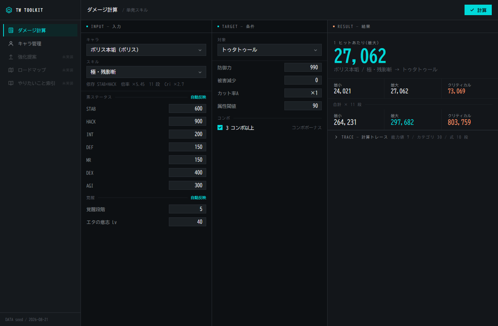

# TalesWeaver Toolkit

TalesWeaver(MMORPG)プレイヤー向けのデスクトップツールキット。登録したキャラクターを軸に、ダメージ計算・強化提案・コンテンツ入場ロードマップを提供することを目指す。



## 現在できること

- **キャラ登録** — 名前・キャラ・素ステータス 7 種・覚醒段階・エタの意志 Lv を登録(SQLite に保存)
- **ダメージ計算** — 登録キャラ・スキル・敵を選ぶだけで 最小 / 最大 / クリティカル と合計(×段数)を表示
- **計算トレース** — 能力値計算、カテゴリ集計(全 30 カテゴリ)、与ダメージ式の各段をすべて展開表示

シードデータはボリス 1 体・スキル 5 件・敵 3 体。装備・バフ・属性は未実装(中立値で式に参加)。

## 技術スタック

| 層 | 技術 |
|---|---|
| アプリ | Tauri 2(Rust) |
| フロント | Svelte 5 + TypeScript + Vite |
| データ保存 | SQLite(rusqlite) |

```
crates/domain    ドメインモデルと計算(I/O なし・決定的)
crates/gamedata  wiki 由来の静的データ(出典付き)
crates/storage   登録キャラの永続化
apps/desktop     Tauri シェル + UI
```

詳細は [docs/architecture.md](docs/architecture.md)。

## セットアップ

前提: Rust stable(MSVC)、VS 2022 Build Tools(C++ ワークロード)、Node 22、WebView2。

```sh
cd apps/desktop && npm install
```

## 実行・テスト

```sh
cargo test --workspace                  # テスト(リポジトリルート)
cd apps/desktop && npm run tauri dev    # 開発起動(初回の Rust ビルドは数分)
cd apps/desktop && npm run build && npx svelte-check   # フロント単体チェック
```

DB は `%APPDATA%\com.talesweaver.toolkit\talesweaver-toolkit.sqlite` に作られる。

## ドキュメント

- [docs/damage-formula.md](docs/damage-formula.md) — ダメージ計算・ステータス仕様(talewiki 整理)
- [docs/architecture.md](docs/architecture.md) — クレート構成と依存の向き
- [docs/decisions.md](docs/decisions.md) — 設計判断と仮決定の記録
- [docs/legacy-twtoolkit.md](docs/legacy-twtoolkit.md) — 旧リポジトリの棚卸し

## 情報ソース

ゲーム仕様の一次ソースは [Tale Wiki](https://talewiki.com/)。旧リポジトリ(Excel 計算器移植)由来の数値は `[仮]` として扱い、wiki で裏取りしてから確定する。
