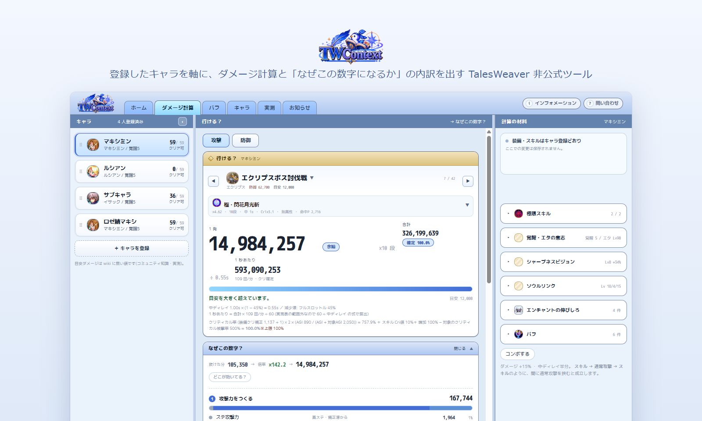

# TW Context

TalesWeaver(MMORPG)プレイヤー向けの非公式ツール。
登録したキャラクターを軸に、ダメージ計算と「なぜその数字になるか」の内訳を出します。
Windows 向けデスクトップ版と、インストール不要のブラウザ版があります。

> **非公式ツールです。** ゲームの開発元・運営元とは一切関係がなく、公認・提携・後援を受けていません。
> ゲームクライアントには接続せず、ゲームのファイルも読み書きしません。
> 同梱しているデータ・画像の出典と権利については [NOTICE.md](NOTICE.md) を参照してください。



## 使う

| | |
|---|---|
| デスクトップ版(Windows 10 / 11) | [tw-context.dev](https://tw-context.dev/) からインストーラを取得。新しい版が出るとアプリ内で知らせます |
| ブラウザ版 | [app.tw-context.dev](https://app.tw-context.dev/) を開くだけ。データはそのブラウザの中に保存されます |
| 過去の版 | [GitHub Releases](https://github.com/matsumoto14/talesweaver-toolkit/releases) |

利用者向けの変更点は [CHANGELOG.md](CHANGELOG.md)。

## できること

- **キャラ** — 名前とキャラ種だけで登録し、素ステータス・覚醒 / エタの意志・装備(12 部位 + エンチャント・強化・
  アビリティ・ランダムオプション)・シエナのオーラ・テシスコア・称号・属性・ルーン・クラウン・カード・ペット・
  共通スキル・マスタリーを編集できます。値を触ると保存前でも最終能力値が即時に再計算されます
- **ダメージ計算** — キャラ・スキル・相手を選ぶだけで 1 発(最小 / 最大)・合計(× 段数)・クリティカル(発生率つき)と
  1 秒あたりの火力(DPS)を表示します。防御側の見方(物理 / 魔法 / 複合の防御力・カット率・回避 P)もここにあります
- **なぜこの数字?** — 攻撃力の内訳、相手の防御をどれだけ抜けているか、どの倍率で伸びているかを展開表示。
  能力値計算・カテゴリ集計・与ダメージ式の各段まで追えます
- **もし〜だったら** — 装備やステータスを仮に変えたときの差分を、キャラに保存せず試せます
- **バフ** — 常用バフの組み合わせを保存し、計算に載せられます
- **ホーム** — 登録キャラごとに、今日の期限・強化の候補・行けるコンテンツ(入場条件に対する不足つき)をまとめて出します
- **実測** — ゲームで実際に出たダメージを送れます。収録済みの敵なら計算との差がその場で出ます

静的データ(スキル・敵・装備・称号など)は [Tale Wiki](https://talewiki.com/) を一次ソースとして同梱しています。
wiki に無く実測に頼っている値はアプリ内で `[仮]` と表示します。

## データの扱い

- 登録したキャラクター情報は**お使いの PC の中だけ**に保存されます
  (`%APPDATA%\dev.twcontext.app\tw-context.sqlite`)。更新のたびに自動でバックアップします(直近 3 世代)
- ブラウザ版では**そのブラウザの中だけ**(IndexedDB)に保存されます。サイトデータを消すと一緒に消えるので、
  情報パネルの**書き出す / 読み込む**(JSON 1 ファイル)で控えを取れます。デスクトップ版との行き来もこのファイルで行えます
- 外部へ送信するのは、アプリ内の**問い合わせ・実測を送ったときだけ**です。送信前に送る内容が全文表示されます。
  そのほかの通信は更新確認とお知らせの取得(どちらも読むだけ)に限ります。詳細は [SECURITY.md](SECURITY.md)

## 貢献・問い合わせ

不具合報告や要望は [Issue](https://github.com/matsumoto14/talesweaver-toolkit/issues) へ。アプリの右上「情報」からも送れます。
敵のステータスは wiki でも推定値が多く、実測の投稿が精度に直結します(逆算の仕組みは
[docs/enemy-verification.md](docs/enemy-verification.md))。

## 開発

前提: Rust stable(MSVC)、VS 2022 Build Tools(C++ ワークロード)、Node 22、WebView2。

```sh
cd apps/desktop && npm install

cargo test --workspace                                  # テスト(リポジトリルート)
cd apps/desktop && npm run tauri dev                    # 開発起動(初回の Rust ビルドは数分)
cd apps/desktop && npm run build && npx svelte-check    # フロント単体チェック
```

ブラウザ版は同じ画面・同じ計算を WASM(`crates/web`)の上で動かします。切り替えは Vite の alias なので、
デスクトップ版のバンドルに WASM は入りません。

```sh
cargo install wasm-pack --locked && rustup target add wasm32-unknown-unknown   # 初回だけ
cd apps/desktop && npm run build:web      # WASM をビルドして dist-web に出す
cd apps/desktop && npm run preview:web    # dist-web を配信して確認
```

### 構成

| 層 | 技術 |
|---|---|
| アプリ | Tauri 2(Rust) |
| フロント | Svelte 5 + TypeScript + Vite |
| データ保存 | SQLite(rusqlite)/ ブラウザ版は IndexedDB |

```
crates/domain            ドメインモデルと計算(I/O なし・決定的)
crates/gamedata          wiki 由来の静的データ(出典付き)
crates/commands          保存に触らないコマンドの中身(デスクトップ / ブラウザ共通)
crates/storage           登録キャラの永続化(デスクトップ版。rusqlite)
crates/web               ブラウザ版の入口(WASM。保存は IndexedDB で TS 側)
apps/desktop             Tauri シェル + UI(画面は両方で同じもの)
services/inquiry-worker  問い合わせを GitHub Issue にする中継(Cloudflare Workers)
site/                    紹介ページ(tw-context.dev)
```

### ドキュメント

- [docs/architecture.md](docs/architecture.md) — クレート構成・フロント階層・依存の向き
- [docs/damage-formula.md](docs/damage-formula.md) — ダメージ計算・ステータス仕様(Tale Wiki の整理)
- [docs/enemy-verification.md](docs/enemy-verification.md) — 敵ステータスを実測ダメージから逆算する手順
- [docs/ux-guidelines.md](docs/ux-guidelines.md) — UI 実装時の判断基準
- [docs/design-system.html](docs/design-system.html) — デザインシステム(ブラウザで開く)
- [docs/web-deploy.md](docs/web-deploy.md) — ブラウザ版の配信設定(Cloudflare)
- [docs/adr/](docs/adr/) — テーマ別の決定記録(なぜそうなっているか)

AI エージェント向けの指示は [AGENTS.md](AGENTS.md)、手順は `.claude/skills/`。

## ライセンス

ソースコードと文書は [MIT License](LICENSE)。
同梱しているゲーム由来の画像・数値データは対象外です([NOTICE.md](NOTICE.md))。
