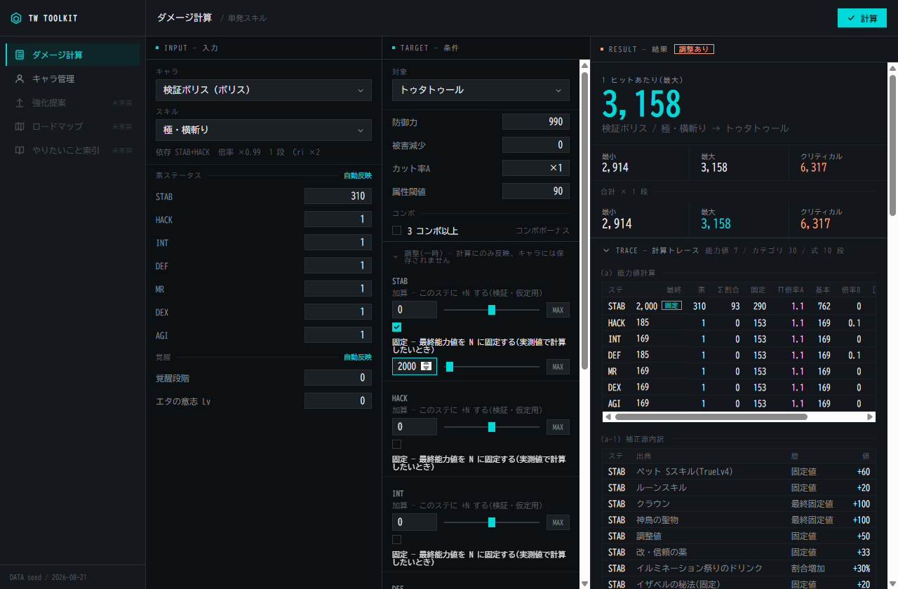

# TW Context

TalesWeaver(MMORPG)プレイヤー向けのデスクトップツールキット。
登録したキャラクターを軸に、ダメージ計算・強化提案・コンテンツ入場ロードマップを提供します。

> **非公式ツールです。** ゲームの開発元・運営元とは一切関係がなく、公認・提携・後援を受けていません。
> ゲームクライアントには接続せず、ゲームのファイルも読み書きしません。
> 同梱しているデータ・画像の出典と権利については [NOTICE.md](NOTICE.md) を参照してください。



## できること

- **キャラクター管理** — 名前とキャラ種だけで登録し、素ステータス・覚醒 / エタの意志・
  装備(部位別 12 スロット + エンチャント + 強化 + 武器アビリティ + ランダムオプション)・
  シエナのオーラ・テシスコア・称号・属性・ルーン・クラウン・カード・ペット・
  共通スキル・マスタリー・常用バフ・調整値を編集できます。触ると保存前でも最終能力値が即時に再計算されます
- **ダメージ計算** — キャラ・スキル・コンテンツを選ぶだけで 1 発(最小 / 最大)・合計(× 段数)・
  クリティカル(発生率つき)と、1 秒あたりの火力(DPS)を表示します
- **なぜこの数字?** — 攻撃力の内訳、相手の防御をどれだけ抜けているか、どの倍率で伸びているかを展開表示。
  能力値計算・カテゴリ集計(全 30 カテゴリ)・与ダメージ式の各段まですべて追えます
- **もし〜だったら** — 装備やステータスを仮に変えたときの差分を、キャラに保存せず試せます
- **ホーム** — エリアごとのコンテンツ到達一覧。入場条件に対する不足を出します
- **防御側** — 物理 / 魔法 / 複合の防御力・カット率・回避 P・特殊回避

静的データは Tale Wiki 由来で、プレイアブル 19 キャラ・スキル 303 件・キャラスキル 71 件・
マスタリー 243 件・敵 42 体・コンテンツ 59 件・称号・装備カタログなどを同梱しています。
進捗の詳細は [docs/status.md](docs/status.md)、利用者向けの変更点は [CHANGELOG.md](CHANGELOG.md)。

## データの扱い

- 登録したキャラクター情報は**お使いの PC の中だけ**に保存されます
  (`%APPDATA%\dev.twcontext.app\talesweaver-toolkit.sqlite`)
- 外部へ送信するのは、アプリ内の**問い合わせを送ったときだけ**です。
  送信前に送る内容が全文表示されるので、確認してから送れます
- 更新のたびにデータベースを自動でバックアップします(直近 3 世代)

## 技術スタック

| 層 | 技術 |
|---|---|
| アプリ | Tauri 2(Rust) |
| フロント | Svelte 5 + TypeScript + Vite |
| データ保存 | SQLite(rusqlite) |

```
crates/domain            ドメインモデルと計算(I/O なし・決定的)
crates/gamedata          wiki 由来の静的データ(出典付き)
crates/storage           登録キャラの永続化
apps/desktop             Tauri シェル + UI
services/inquiry-worker  問い合わせを GitHub Issue にする中継(Cloudflare Workers)
```

詳細は [docs/architecture.md](docs/architecture.md)。

## 開発

前提: Rust stable(MSVC)、VS 2022 Build Tools(C++ ワークロード)、Node 22、WebView2。

```sh
cd apps/desktop && npm install

cargo test --workspace                  # テスト(リポジトリルート)
cd apps/desktop && npm run tauri dev    # 開発起動(初回の Rust ビルドは数分)
cd apps/desktop && npm run build && npx svelte-check   # フロント単体チェック
```

## ドキュメント

ブラウザで読むなら [docs/site/index.html](docs/site/index.html)(md から生成。`python tools/docs-site/build.py`)。

- [docs/architecture.md](docs/architecture.md) — クレート構成・フロント階層・依存の向き
- [docs/ux-guidelines.md](docs/ux-guidelines.md) — UI 実装時の判断基準(4 原則)
- [docs/design-system.html](docs/design-system.html) — デザインシステム(ブラウザで開く)
- [docs/damage-formula.md](docs/damage-formula.md) — ダメージ計算・ステータス仕様(talewiki 整理)
- [docs/status.md](docs/status.md) — 進捗
- [docs/legacy-twtoolkit.md](docs/legacy-twtoolkit.md) — 旧リポジトリの棚卸し

エージェント向け(作業記録・運用): [docs/claude/](docs/claude/) — decisions.md(設計判断と仮決定)、
goals/(各 goal の受け入れ条件)、workflow.md(運用ガイド)

## 貢献・問い合わせ

不具合報告や要望は [Issue](https://github.com/matsumoto14/talesweaver-toolkit/issues) へ。
アプリの右上「情報」からも直接送れます。

## ライセンス

ソースコードと文書は [MIT License](LICENSE)。
同梱しているゲーム由来の画像・数値データは対象外です([NOTICE.md](NOTICE.md))。

## 情報ソース

ゲーム仕様の一次ソースは [Tale Wiki](https://talewiki.com/)。
旧リポジトリ(Excel 計算器移植)由来の数値は `[仮]` として扱い、wiki で裏取りしてから確定します。
